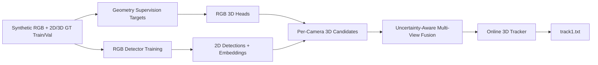

# Research Innovation: STAR-3D++

## Problem Diagnosis

AI City 2026 Track 1 is a calibrated multi-camera 3D tracking task. The output
is not camera-level detections; it is one global 3D trajectory set per scene:

```text
scene_id class_id object_id frame_id x y z width length height yaw
```

The metric is 3D HOTA, so three failures hurt:

- missing or duplicate objects reduce DetA;
- wrong 3D centers, sizes, or yaw reduce LocA and high-threshold HOTA;
- identity switches and fragmented trajectories reduce AssA.

The 2026 difficulty is Sim2Real. The current downloaded train/val directories
contain empty `depth_maps` folders, so the usable data is RGB videos,
calibration, 2D GT, and 3D GT for train/val. Test scenes provide RGB videos and
calibration only. A winning solution must therefore learn RGB-to-3D geometry
directly from 3D annotations and calibration, not from depth maps.

## Prior Work Lessons

### Point-Cloud/ReID Winner

The 2025 point-cloud/ReID approach reconstructs a unified 3D point cloud from
RGB-D, detects objects in 3D, learns 3D embeddings, and globally links
tracklets. This is strong because it attacks localization and association in
the metric's native 3D space.

Limitation for our current 2026 data: train/val `depth_maps` folders are empty
and test has no depth. We should reuse the idea of 3D-native association and
global linking, not the RGB-D point-cloud dependency.

### DepthTrack / BEV Cluster

DepthTrack shows that 2D detections, single-view tracking, BEV clustering, and
tracklet-cluster mapping are a practical path for multi-camera 3D tracking. It
is modular and closer to online inference than a full offline point-cloud
pipeline.

Limitation for 2026: class handling and scene-specific assumptions must be
updated for PalletTruck and real camera appearance.

### VGCRTrack

VGCRTrack's strongest idea is view-aware geometric center refinement: use
calibration, rays, reprojection residuals, and temporal smoothing to refine 3D
centers. This directly addresses the real-test case where RGB and calibration
are available but depth is not.

## Proposed Winning System

The final system should be `STAR-3D++`: Sim2Real Temporal Association and
Ray-guided 3D tracking with 3D-GT-supervised geometry distillation.



## Core Contributions To Claim If Implemented

### 1. 3D-GT-Supervised RGB 3D Lifting

Train RGB crop heads directly from synthetic 3D GT and calibration:

- center residual over homography/ray baseline;
- class-conditioned dimensions;
- yaw as circular bins plus residual;
- uncertainty score for fusion;
- 3D usability score that learns when a 2D box is too truncated or too small.

Why this is competitive: the model learns the exact challenge output geometry
from 3D annotations while staying valid for real RGB-only scenes.

Implemented first residual prototype:

- calibration-aware feature vector from normalized 2D box geometry, baseline
  world intersection, camera direction, homography, and projection matrix;
- center, z, logarithmic dimension, and circular yaw targets derived directly
  from synthetic 3D GT;
- heteroscedastic center/dimension loss that predicts uncertainty for fusion;
- scene-held-out validation split;
- early stopping on scene-held-out loss with BEV-center, z, dimension, and yaw
  diagnostics in physical units;
- PyTorch training with export to a NumPy-only `.npz` inference model;
- uncertainty-aware fusion weights and bounded residual corrections.

This first model deliberately excludes RGB crop features. It establishes the
supervised residual target, uncertainty, export, and evaluation path. The next
ablation adds frozen DINOv2/ConvNeXt crop embeddings to measure the value of
appearance beyond calibrated box geometry.

The first full-scale geometry-only model reduced validation HOTA when applied
at full strength. This negative result is retained as an ablation. Residual
inference now supports a bounded blend factor and uncertainty cutoff, and the
main pipeline will keep the geometric baseline whenever the learned correction
is not validated by challenge-level HOTA.

### 2. View-Consistent Center Refinement

For each fused object candidate, optimize the 3D center to minimize:

- per-view reprojection error to detected bottom centers;
- ray-to-center distance;
- map-bound and floor-height penalties;
- class-size prior penalty;
- temporal acceleration penalty from the online track.

Why this is competitive: HOTA localization thresholds are strict. Calibration
lets us recover precision that a detector-only or homography-only method loses.

Implemented calibration step:

- class-conditioned BEV fusion radii, because person and industrial-vehicle
  localization errors have materially different scales;
- per-class validation sweep over radius, minimum camera support, and 3D NMS
  distance using cached lifted candidates;
- export of the selected fused detections and Track 1 submission for direct
  comparison against the global-radius baseline.

### 3. Class-Aware Online Association

Use an online tracker with a state:

```text
x, y, z, vx, vy, vz, width, length, height, yaw, yaw_rate, uncertainty
```

Association cost:

```text
cost =
  w_iou * (1 - 3D_IoU)
  + w_bev * BEV_Mahalanobis
  + w_app * ReID_distance
  + w_ray * ray_consistency_error
  + w_yaw * yaw_error
  + w_shape * dimension_error
```

Why this is competitive: 2026 award ranking gives an online bonus. A strong
online tracker can beat a slightly higher raw-HOTA offline method.

### 4. Sim2Real Curriculum

Train in phases:

1. synthetic clean detector;
2. synthetic randomized detector;
3. CT2.5-vs-IsaacSim balanced detector;
4. 3D-GT geometry-head training;
5. real-test-style augmentation and threshold calibration;
6. optional pseudo-labeling if allowed and validated.

Why this is competitive: the hidden test is real. Appearance robustness matters
as much as architecture.

## Implemented Baselines In This Repository

The repository now contains the first complete geometric baseline:

1. export oracle 2D boxes from GT;
2. build class geometry priors;
3. lift 2D bottom centers through calibration homographies;
4. fuse duplicate multi-camera candidates in BEV;
5. assign online IDs;
6. evaluate with the local HOTA-like evaluator.

This baseline is intentionally simple. Its value is that it makes the full
metric path executable before detector training.

Run it:

```bash
cd /path/to/PhysicalAI_Track1
PYTHONPATH=src bash scripts/smoke_geometric_baseline.sh
```

Or through PBS:

```bash
qsub scripts/pbs/smoke_geometric_baseline.pbs
```

Initial result on Warehouse_020, first 120 frames, using oracle 2D detections
and train-sample geometry priors:

```text
2D detections: 19,575
lifted candidates: 19,575
fused detections: 14,108
HOTA-like: 0.2392
DetA: 0.1103
AssA: 0.6085
LocA: 0.5352
```

This is not intended to be competitive yet. It is a diagnostic baseline showing
that homography-only lifting leaves too many duplicates and inaccurate centers.
The next high-impact improvements are learned center residuals, view-consistent
center refinement, and better duplicate suppression.

## Experiment Ladder

### A. Sanity Checks

- GT-to-submission oracle: HOTA-like near 1.0.
- GT-2D geometric baseline: measures calibration/lifting/fusion quality.
- Oracle IDs with lifted boxes: separates geometry error from association
  error.

### B. Detector Experiments

- YOLO/RT-DETR high-recall baseline at 1280.
- H100 high-resolution run at 1536 or 1920.
- Rare-class oversampling.
- Low-light and compression augmentation.
- Class-specific thresholds optimized on validation HOTA.

### C. Geometry Experiments

- homography-only bottom-center lifting;
- learned center residual;
- learned dimensions;
- learned yaw;
- uncertainty-weighted fusion;
- VGCR-style nonlinear center refinement.

### D. Tracking Experiments

- nearest-neighbor online tracker;
- Kalman/IMM tracker;
- ReID-enhanced association;
- long-occlusion memory;
- duplicate merge and crossing-safe split handling.

### E. Final Submission Strategy

- `online_bonus`: final award-focused system.
- `offline_max_raw`: stronger global linker for diagnosis and leaderboard
  probing.
- Submit online if:

```text
online_raw_hota * 1.10 >= offline_raw_hota
```

## Why This Can Win

The system is aligned with the challenge, not just with generic detection:

- It optimizes the output space directly: 3D boxes and persistent scene IDs.
- It uses 3D GT where it matters most: direct supervision of center, size, yaw,
  uncertainty, and association.
- It remains legal and usable on real RGB-only scenes.
- It targets HOTA's three components explicitly: DetA, LocA, and AssA.
- It preserves an online path for the 10 percent award bonus.
