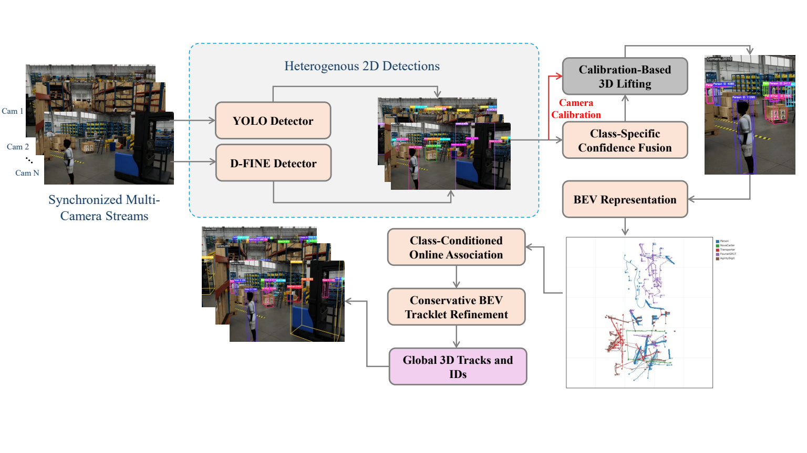
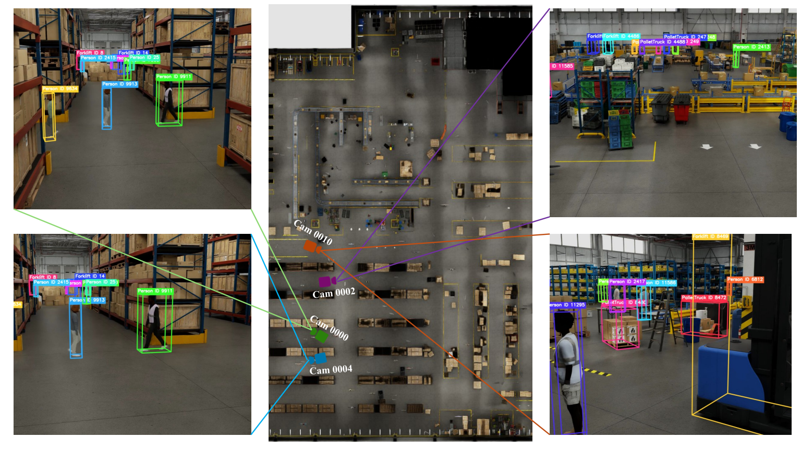

# STAR-3D

**Association-Preserving RGB-Only Multi-Camera 3D Tracking under Sim2Real Shift**

This repository contains the code, experiment scripts, and final paper PDF for our
AI City Challenge 2026 Track 1 system. Track 1 evaluates multi-camera 3D
perception in calibrated smart spaces: given synchronized RGB videos and camera
calibration, the system must produce global 3D bounding boxes and persistent
object IDs.

STAR-3D is a calibrated tracking-by-detection pipeline designed for the 2026
Sim2Real setting. It combines high-resolution 2D detection, heterogeneous
detector fusion, calibration-guided 3D lifting, class-conditioned online
association, and conservative BEV tracklet relinking.

## Highlights

- RGB-only inference path for test scenes with no required native test depth.
- YOLO/D-FINE detector fusion with class-specific score calibration.
- Camera-calibrated lifting from 2D detections to global 3D candidates.
- Reliability-guided multi-view fusion using confidence, camera support, and
  BEV compactness.
- Class-conditioned online tracker with per-class association gates and memory.
- Conservative BEV tracklet graph refinement for reducing ID fragmentation.
- PBS scripts for end-to-end training, validation, inference, and submission.

## Challenge Result

Our best final official submission was:

| Submission | 3D HOTA (%) | DetA (%) | AssA (%) | LocA (%) |
|---|---:|---:|---:|---:|
| YOLO11x-1920 + D-FINE + BEV graph | **12.4128** | 14.5213 | 11.8109 | 57.0038 |

The repository also records ablations for detector settings, confidence
calibration, BEV relinking, class-hybrid correction, and depth-based variants in
[`PhysicalAI_Track1/docs/EXPERIMENT_LOG.md`](PhysicalAI_Track1/docs/EXPERIMENT_LOG.md).

## Method Overview

<p align="center">
  <a href="Star-3D.pdf">
    
  </a>
</p>

The submission format is one whitespace-delimited text file:

```text
scene_id class_id object_id frame_id x y z width length height yaw
```

The class IDs follow the challenge convention:

| ID | Class |
|---:|---|
| 0 | Person |
| 1 | Forklift |
| 2 | NovaCarter |
| 3 | Transporter |
| 4 | FourierGR1T2 |
| 5 | AgilityDigit |
| 6 | PalletTruck |

## Repository Layout

```text
PhysicalAI_Track1/
  src/physicalai_track1/       Python package for dataset IO, lifting, fusion, tracking, evaluation
  scripts/                     Standalone training, inference, V-DETR/depth, and visualization helpers
  scripts/pbs/                 PBS job templates used on the HPC cluster
  configs/                     STAR-3D, detector, and V-DETR configuration files
  docs/                        Research notes, experiment log, backlog, and paper outline
  tests/                       Unit tests for geometry, fusion, tracking, and format logic

docs/assets/                    README preview images
ECCV_AICity26_Track1.pdf        Final workshop paper
Star-3D.pdf                     STAR-3D paper copy
track1.pdf                      Track 1 paper copy
```

Large generated assets, datasets, checkpoints, submission zips, and cloned
third-party repositories are intentionally ignored by Git. See
[`docs/ARTIFACT_POLICY.md`](docs/ARTIFACT_POLICY.md).

## Installation

The core STAR-3D package is lightweight and can be installed without GPU
dependencies:

```bash
cd PhysicalAI_Track1
python -m venv .venv
source .venv/bin/activate
pip install -U pip
pip install -e .
```

For detector training or D-FINE/RF-DETR/V-DETR experiments, use separate
environment scripts under `PhysicalAI_Track1/scripts/pbs/` because those stacks
have different CUDA and compiler requirements.

## Dataset Setup

Download the dataset from the NVIDIA PhysicalAI Smart Spaces Hugging Face
repository:

- Dataset card:
  <https://huggingface.co/datasets/nvidia/PhysicalAI-SmartSpaces/blob/main/README.md>
- 2026 train split:
  <https://huggingface.co/datasets/nvidia/PhysicalAI-SmartSpaces/tree/main/MTMC_Tracking_2026/train>
- 2026 validation split:
  <https://huggingface.co/datasets/nvidia/PhysicalAI-SmartSpaces/tree/main/MTMC_Tracking_2026/val>
- 2026 test split:
  <https://huggingface.co/datasets/nvidia/PhysicalAI-SmartSpaces/tree/main/MTMC_Tracking_2026/test>

The full repository is large because it includes depth maps. For the RGB-only
STAR-3D pipeline, download at least the 2026 RGB videos, calibration files, and
train/validation annotations:

```bash
pip install -U huggingface_hub

export PHYSICALAI_DATA_ROOT=/path/to/PhysicalAI-SmartSpaces

hf download nvidia/PhysicalAI-SmartSpaces \
  --repo-type dataset \
  --include "MTMC_Tracking_2026/train/**" \
  --include "MTMC_Tracking_2026/val/**" \
  --include "MTMC_Tracking_2026/test/**" \
  --local-dir "$PHYSICALAI_DATA_ROOT"
```

If disk space is limited, omit `depth_maps/` with an exclude rule:

```bash
hf download nvidia/PhysicalAI-SmartSpaces \
  --repo-type dataset \
  --include "MTMC_Tracking_2026/**" \
  --exclude "MTMC_Tracking_2026/**/depth_maps/**" \
  --local-dir "$PHYSICALAI_DATA_ROOT"
```

Then set:

```bash
export STAR3D_SCRATCH=/path/to/scratch/PhysicalAI_Track1
```

Expected dataset layout:

```text
$PHYSICALAI_DATA_ROOT/
  MTMC_Tracking_2026/
    train/
      Warehouse_000/
      ...
      Warehouse_019/
    val/
      Warehouse_020/
      Warehouse_021/
      Warehouse_022/
    test/
      Warehouse_023/
      ...
      Warehouse_027/
```

Each synthetic train/validation scene follows the 2025/2026 dataset schema:

```text
Warehouse_xxx/
  videos/              RGB camera videos, MP4/H.264, 1080p at 30 FPS
  depth_maps/          Optional depth maps, very large
  ground_truth.json    Train/validation 2D and 3D annotations
  calibration.json     Camera intrinsics, extrinsics, camera matrix, homography
  map.png              Top-down scene map
```

Test scenes provide videos and calibration for inference. Ground truth is not
used by the submission pipeline.

## Quick Smoke Test

```bash
cd PhysicalAI_Track1

python -m physicalai_track1 inspect \
  --data-root "$PHYSICALAI_DATA_ROOT" \
  --year 2026

python -m physicalai_track1 gt-to-submission \
  --data-root "$PHYSICALAI_DATA_ROOT" \
  --year 2026 \
  --split val \
  --frame-stride 30 \
  --out "$STAR3D_SCRATCH/oracle_val_stride30.txt"

python -m physicalai_track1 eval \
  --data-root "$PHYSICALAI_DATA_ROOT" \
  --year 2026 \
  --split val \
  --frame-stride 30 \
  --pred "$STAR3D_SCRATCH/oracle_val_stride30.txt" \
  --by-class
```

The oracle conversion checks that the dataset parser, box convention, and local
evaluation code are internally consistent.

## End-to-End Pipeline

The full reproduction path is documented in
[`docs/REPRODUCING_STAR3D.md`](docs/REPRODUCING_STAR3D.md). The short version is:

```bash
# 1. Prepare YOLO labels and frame manifests.
qsub PhysicalAI_Track1/scripts/pbs/export_yolo_trainval.pbs

# 2. Extract frames to scratch.
qsub -v MANIFEST=$STAR3D_SCRATCH/datasets/yolo_2026_stride30/train_frames.tsv \
  PhysicalAI_Track1/scripts/pbs/extract_yolo_frames.pbs

qsub -v MANIFEST=$STAR3D_SCRATCH/datasets/yolo_2026_stride30/val_frames.tsv \
  PhysicalAI_Track1/scripts/pbs/extract_yolo_frames.pbs

# 3. Train or evaluate a detector checkpoint.
qsub PhysicalAI_Track1/scripts/pbs/train_yolo_h100_preemptible.pbs
qsub PhysicalAI_Track1/scripts/pbs/infer_dfine_val_to_star.pbs

# 4. Fuse detector outputs and run STAR-3D.
qsub PhysicalAI_Track1/scripts/pbs/ensemble_yolo_dfine_val_to_star.pbs

# 5. Create a test submission.
qsub PhysicalAI_Track1/scripts/pbs/prepare_yolo_test_frames.pbs
qsub PhysicalAI_Track1/scripts/pbs/ensemble_yolo_dfine_test_submission.pbs
```

On PBS clusters, check available GPUs before submitting:

```bash
freenodes -cg
```

## Qualitative Figures

The qualitative figures in the paper are generated from submitted Track 1
predictions:

```bash
python PhysicalAI_Track1/scripts/visualize_submission_qualitative.py --help
python PhysicalAI_Track1/scripts/visualize_multiview_projection.py --help
```

The multi-camera figure projects global 3D boxes back into each RGB view using
the official camera matrix, then pairs the RGB overlays with the same frame in
the global BEV coordinate system.

## Paper

The final ECCV AI City workshop paper and companion copies are included here:

- [`ECCV_AICity26_Track1.pdf`](ECCV_AICity26_Track1.pdf)
- [`Star-3D.pdf`](Star-3D.pdf)
- [`track1.pdf`](track1.pdf)

Click the preview below to open the Track 1 PDF. The STAR-3D teaser is shown in
the method overview above.

<p align="center">
  <a href="track1.pdf">
    
  </a>
</p>

When citing this work, use the citation entry in
[`CITATION.cff`](CITATION.cff). The final BibTeX entry can be updated after the
workshop proceedings metadata is available.

## Acknowledgement

This work used resources of the Center for Computationally Assisted Science and
Technology (CCAST) at North Dakota State University, which were made possible in
part by NSF MRI Award No. 2019077.

## License

Code is released under the MIT License. Dataset files, challenge data,
third-party repositories, and model checkpoints are not redistributed here and
remain under their original licenses.
